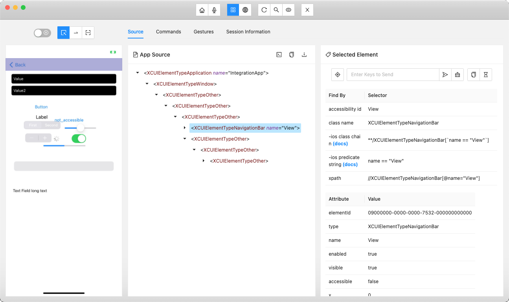

   

   GUI Inspector tool for all kinds of apps, powered by Appium.

---

<b>
   <a href="https://appium.github.io/appium-inspector/">Documentation</a> |
   <a href="https://appium.github.io/appium-inspector/latest/quickstart/">Get Started</a> |
   <a href="https://discuss.appium.io">Discussion Forum</a> |
   <a href="https://crowdin.com/project/appium-desktop">Help with Translations</a>
</b>

---

Appium Inspector is a GUI assistant tool for Appium, providing visual inspection of the application
under test. It can show the application page screenshot along with its page source, and includes
various features for interacting with the app.

When inspecting a mobile app, the Inspector looks like this:

## Installation

Appium Inspector is released in two formats:

1. Standalone desktop application for macOS, Windows, and Linux - download it from the
   [**Releases**](https://github.com/appium/appium-inspector/releases) section
2. Web application - **<https://inspector.appiumpro.com>** (note that
   [CORS must be enabled](https://appium.github.io/appium-inspector/latest/troubleshooting/#cannot-start-a-session-using-browser-inspector)
   in order to connect to an Appium server)

Check the [System Requirements](https://appium.github.io/appium-inspector/latest/quickstart/requirements/)
and [Installation](https://appium.github.io/appium-inspector/latest/quickstart/installation/)
documentation for more details.

## Features

The Inspector has many features in addition to its app inspection abilities:

- Specify the Appium server details
- Interact with the app screenshot
- Search for elements and interact with them
- Run Appium driver commands
- and more...

Check the [Features documentation](https://appium.github.io/appium-inspector/latest/overview/#features-overview)
for a more comprehensive list!

### Cloud Platforms

The Inspector has built-in integrations with various cloud service provider platforms:

<table>
  <tr>
    <td align="center" valign="center">
      
    </td>
    <td align="center" valign="center">
      
    </td>
    <td align="center" valign="center">
      
    </td>
    <td align="center" valign="center">
      
    </td>
  </tr>
  <tr>
    <td align="center" valign="center">
      
    </td>
    <td align="center" valign="center">
      
    </td>
    <td align="center" valign="center">
      
    </td>
    <td align="center" valign="center">
      
    </td>
  </tr>
  <tr>
    <td align="center" valign="center">
      
    </td>
    <td align="center" valign="center">
      
    </td>
    <td align="center" valign="center">
      
    </td>
    <td align="center" valign="center">
      
    </td>
  </tr>
  <tr>
    <td align="center" valign="center">
      
    </td>
  </tr>
</table>

> [!NOTE]
>
> We may remove cloud providers if they no longer work properly with this inspector, as there is no compatibility.

## Reporting Issues

If you run into a problem, first check whether you can reproduce it _without_ the Inspector, by using a different Appium client.

- If the issue still exists, then it's _not_ an issue with the Inspector - report it at the [main Appium repo](https://github.com/appium/appium/issues)
- If the issue is gone, then it is likely specific to the Inspector -
  [please report it in this repo](https://github.com/appium/appium-inspector/issues/new?assignees=&labels=bug&projects=&template=bug_report.yml&title=bug%3A+%3Ctitle%3E)

## Development

Want to help us develop this app? Awesome! Please check the
[Contributing documentation](https://appium.github.io/appium-inspector/latest/contributing/) for details.

### Localization

Localization for the Inspector is provided by [Crowdin](https://crowdin.com/project/appium-desktop).
If you would like to help translate this app, please check the [Localization section](https://appium.github.io/appium-inspector/2023.12/contributing/#localization)
of the Contributing documentation.

## Version Schema

The Inspector's version schema is `<RELEASE_YEAR>.<RELEASE_MONTH_NUM>.<RELEASE_COUNT_FOR_MONTH>`.
For example, the first release in the month of April in the year 2022 would be `2022.4.1`, and the
10th in that month would be `2022.4.10`.
