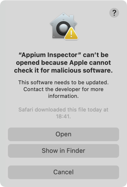

If you are using the Inspector's web app version, this step is, of course, not required. But for
the Inspector desktop app, it needs to be installed first.

The app can be downloaded from [the Inspector's GitHub repository](https://github.com/appium/appium-inspector/releases).
Different file formats are provided for each supported platform.

## Windows

Installing the Windows version is easiest by downloading the appropriate `.exe` file. When opening
the file, it is possible that Windows [may show a warning](https://github.com/appium/appium-inspector/issues/1134),
though this can be bypassed. If successful, the installation wizard will open, and after following
the required steps, the Inspector should be installed and ready to use.

## macOS

The macOS version may be easiest to set up by downloading the `.dmg` file. Opening it will show a
simple window, where the Inspector icon should be dragged-and-dropped to the _Applications_ folder
icon. This will extract the app, after which it can be opened from the _Applications_ folder.

When you run the app, you may be greeted with some error about the app not being able to be opened,
not verified by Apple, or something similar. The easiest way to get around this is as follows:

1. _Control+Click_ the Appium Inspector icon in the _Applications_ folder and choose _Open_.
   

2. The dialog below will open. Just click _Open_ and Appium Inspector should launch.
   

There is also an alternative approach which uses the command line. Run the following command:

```
xattr -cr "/Applications/Appium Inspector.app"
```

After this, opening the app should not produce any warnings anymore.

## Linux

The Linux version is packaged as an `.AppImage` file. In order to open the file, its executable flag
needs to be set first:

```
chmod a+x Appium-Inspector-linux-<version>.AppImage
```

Afterwards, the app can be opened through the command line:

```
./Appium-Inspector-linux-<version>.AppImage
```
