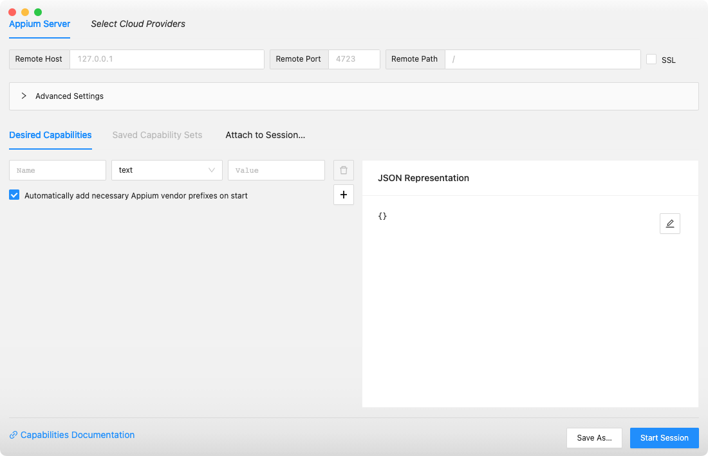
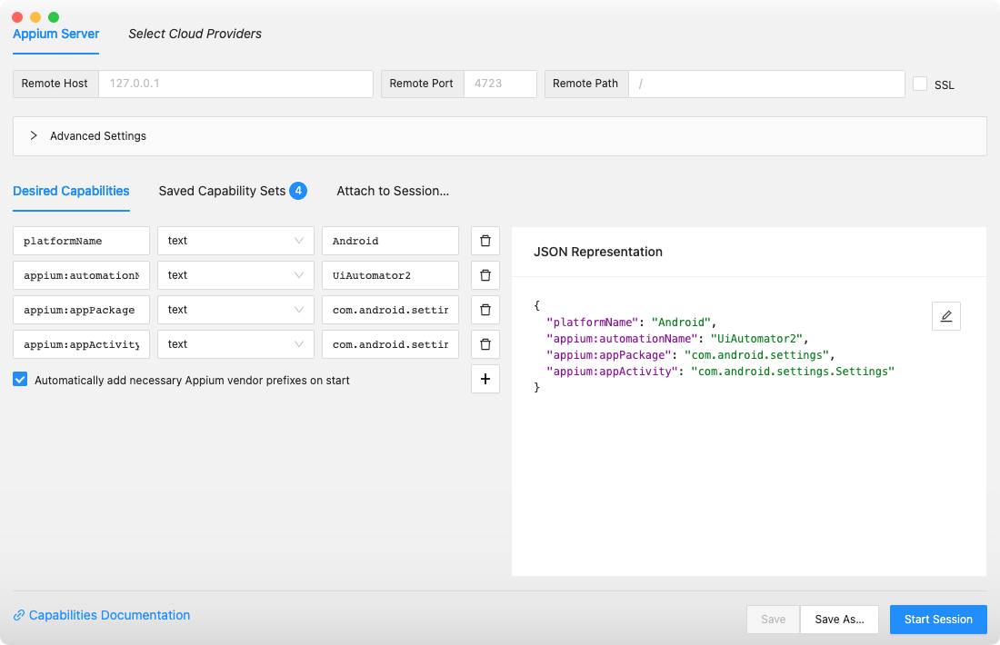
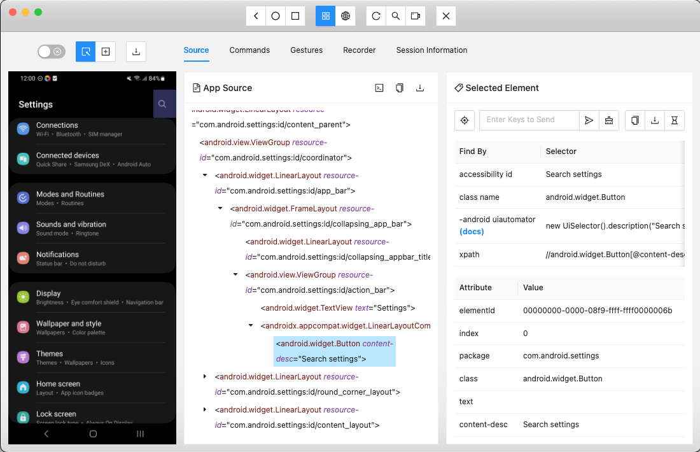

Now that the Inspector is installed (if necessary) and opened, you should be greeted with a screen
like this:



This is the __Session Configurator__ screen, where the server and session details are specified.

## Adding Server Details


The server details section at the top of the window is where information about the Appium server is
specified, so that the Inspector knows how to connect to it:

* If you wish to connect to a cloud provider service, choose your vendor using the _Select Cloud
  Providers_ button, switch to its tab, and fill in the required details.

* If you wish to connect to a standalone local or remote Appium server, please make sure the server
  is launched and running. The start of the server log will have a list of addresses and ports that
  can be used to connect to it.

    * For a local Appium server running on its default port, __all server details fields can be left
      unchanged__. By default, the Inspector will attempt to connect to `http://127.0.0.1:4723`,
      which matches the default values of the Appium server.

    !!! note

        The above assumes that you are using Appium 2. If using Appium 1, the _Remote Path_ value
        must be changed to `/wd/hub`. This may also apply to an Appium 2 server, if it was launched
        with the `--base-path="/wd/hub"` argument.

    * For a local or remote Appium server with non-default properties, please change the field
      values accordingly.

With the server details specified, you can move on to the session details!

## Adding Session Details


The session details take up the majority of the Session Configurator screen. This is the place
where your session [Capabilities](https://appium.io/docs/en/latest/guides/caps/) should be specified.

!!! warning

    Appium has several mandatory capabilities (see above link). Attempting to establish a session
    without any capabilities will not work.

You can enter these capabilities one by one on the left side, or you can edit the whole capability
set in JSON format on the right. Choose your preferred input method.

So then, what capabilities should be entered? This depends on your target platform, and the Appium
driver that you want to use. Here are some basic capability sets not specific to any app:

=== "UiAutomator2"

    ```json
    {
      "platformName": "Android",
      "appium:automationName": "UiAutomator2"
    }
    ```

    Refer to the [UiAutomator2 driver capabilities documentation](https://github.com/appium/appium-uiautomator2-driver#general)
    for more details.

=== "XCUITest"

    ```json
    {
      "platformName": "iOS",
      "appium:automationName": "XCUITest",
      "appium:udid": "<device udid>"
    }
    ```

    Refer to the [XCUITest driver capabilities documentation](https://appium.github.io/appium-xcuitest-driver/latest/capabilities)
    for more details.

=== "Mac2"

    ```json
    {
      "platformName": "Mac",
      "appium:automationName": "Mac2"
    }
    ```

    Refer to the [Mac2 driver capabilities documentation](https://github.com/appium/appium-mac2-driver#capabilities)
    for more details.

Now that the capabilities are set, the session can be launched!

## Launching the Session

For a final check, here is an example image of a Session Configurator with fully configured server
and session information:



You can see the following details:

* The server details are unchanged, which means the Inspector will try to connect to a local Appium
  server on its default port
* The session capabilities are set to use the UiAutomator2 driver, with additional capabilities for
  the Android system settings app

Of course, your own server and session details will likely vary.

You can now press the blue _Start Session_ button - hopefully your session will be created, in
which case the __Session Inspector__ screen will open:



If this has worked, you are done with the quickstart, and can start exploring your app, as well as
other Inspector features! If something went wrong, please check the [Troubleshooting](../troubleshooting.md)
page for potential issues.
