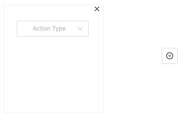
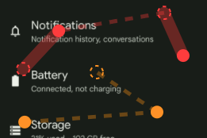
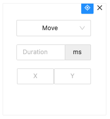
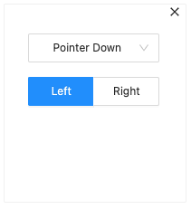
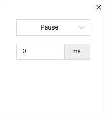

The Gestures tab allows to create, save, and execute custom gestures. By default, switching to this
tab shows the Saved Gestures screen.

## Saved Gestures

The default saved gestures list is empty, but can be populated by creating and saving new gestures.
This can be done by pressing the `+` button in the bottom left, which will open the
[Gesture Builder](#gesture-builder) screen.

Once a gesture has been created and saved, clicking its entry in the saved gestures list will show
its expected actions as an overlay over the [screenshot](./screenshot.md). There are also 3 buttons
for each gesture:

* Execute the gesture
* Edit the gesture (will open it in the [Gesture Builder](#gesture-builder))
* Delete the gesture

## Gesture Builder

The gesture builder is opened when creating a new gesture, or editing an existing one.

Most of the [Screenshot panel header buttons](./screenshot.md#screenshot-panel-header) are disabled
while the gesture builder is opened.

The builder screen can be divided into 4 parts:

* Header
* Gesture timeline
* Pointer tabs
* Pointer actions

### Header

The header lists general gesture information, settings, and actions.

* The gesture title and description can be clicked and edited
* The 2-button group allows to set the X/Y coordinate units used for [Move pointer actions](#move):
  either the default relative (percentage) or absolute (pixels)
* The _Play_ button executes the gesture
* The _Save As_ button allows to save the gesture using the specified gesture title
* The _Save_ button is only enabled when editing an existing gesture, and it overwrites the previously
  saved gesture details with the current ones

### Gesture Timeline

When creating a new gesture, a red circle with a questionmark is shown right below the gesture
description. This is the gesture timeline.

The default state indicates that the gesture contains one undefined action.

The timeline can be modified by adding or modifying the [pointer actions](#pointer-actions). Here
is an example timeline for a simple swipe gesture:

These icons show that the timeline contains the following actions:

1. Move to location
1. Pointer down
1. Move to location
1. Pointer up

### Pointer Tabs

The pointer tabs show the current number of pointers used simultaneously in the gesture.

When creating a new gesture, only one pointer is added by default, but it is possible to have up to
5 pointers in the same gesture! Each pointer is underlined with its unique colour, and appears as a
separate row in the [gesture timeline](#gesture-timeline).

The title of each pointer can also be clicked and edited.

### Pointer Actions

Pointer actions are used to define the behavior of each pointer. Each individual action is presented
as a rectangular card, and new cards can be freely added and removed.

The _Action Type_ dropdown is used to select any of the supported actions: move, pointer down,
pointer up, or pause. Each action requires different parameters.

Valid combinations of move/pointer down/pointer up actions will automatically be reflected on the
[screenshot](./screenshot.md), showing the exact behavior of the gesture.

#### Move

The _Move_ action is likely to be the first action in most gestures. It requires specifying the
duration of the action (in milliseconds), as well as the X and Y coordinates for the target
location.

The top right corner of the card also contains an aim button - enabling this button allows to set
the X and Y coordinates by simply clicking on the screenshot.

The values for X and Y coordinates will automatically change depending on the [selected units](#header).

#### Pointer Down/Pointer Up

Both of these actions only require specifying whether the left or right pointer should be used. For
pointer types where this does not apply (e.g. touch), the default left pointer can be used.

#### Pause

The _Pause_ action only requires specifying the pause time (in milliseconds).
