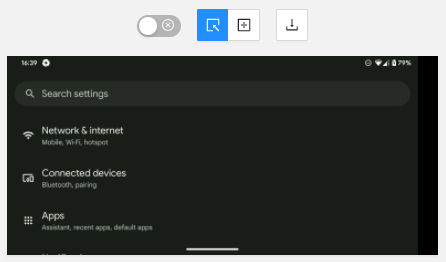

The Screenshot panel is shown on the left side of the Session Inspector. It shows a screenshot of
the current device screen, and also provides several ways of interacting with this screenshot.

## Supported Screenshots

The panel supports all screenshots regardless of dimensions, in any orientation:

The Inspector will try to automatically adjust how much of the window is taken up by the screenshot.
Currently, the limit is either the full window height, or 40% of the window width.

!!! note

    Handling of multiple screenshots (for multi-screen devices) is not currently supported.

## Refreshing the Screenshot

By default, the screenshot itself is a static image, which is only updated when a refresh is
requested. This can happen when:

* interacting with an element (tap/send keys/clear)
* interacting with the screenshot itself (tap/swipe)
* [simulating system actions](./header.md#device-system-buttons)
* [executing driver commands](./commands.md) (depends on the command)
* [executing custom gestures](./gestures.md)
* [pressing the Refresh button](./header.md#refresh-source-screenshot)

It is also possible to have the screenshot update automatically, and always mirror the actual device
screen. This can be achieved by using MJPEG session capabilities, such as `appium:mjpegServerPort`.

## Screenshot Panel Header

The panel header contains several interface elements that allow interacting with the screenshot in
various ways.

### Element Handles Toggle

This switch toggles the visibility of highlighter handles for all identified elements. This can be
very useful if multiple elements overlap around the same coordinates, since the handles then allow
selecting each of these elements separately.

Note that highlighter handles are only shown in Element Interaction Mode.

### Interaction Mode

The Interaction Mode buttons allow switching between the default Element Interaction Mode, and the
Coordinates Interaction Mode. The differences are as follows:

| Mode | Description |
| ---- | ------ |
| Element Interaction Mode | In this mode, hovering over the screenshot will highlight any detected elements. Clicking on any highlighter will then select the corresponding element in the application source, and show its details in the selected element panel. |
| Coordinates Interaction Mode | In this mode, the top left corner of the screenshot will show an coordinates overlay. Hovering over the screenshot will update this overlay with the coordinates on the device screen, and clicking or swiping the screenshot will execute a tap/swipe action on the device. |

### Download Screenshot

This button allows to save the currently shown screenshot on your computer as a `.PNG` file.

!!! info

    This button is not visible when using MJPEG screenshotting capabilities like
    `appium:mjpegServerUrl`.
